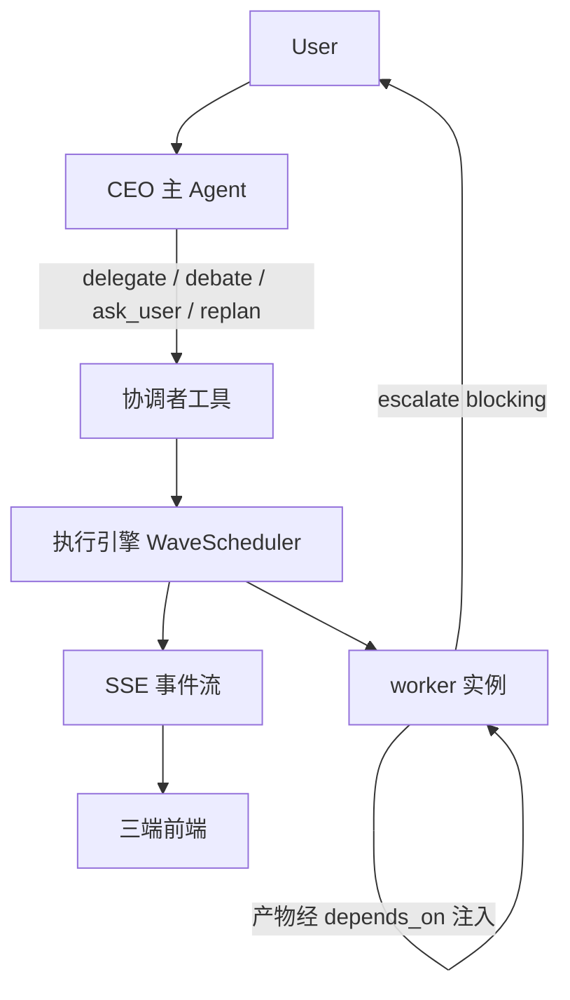

# AI 运行时总览

> **03-AI 核心入口**：先用「端到端速览」给多 Agent 运行时的全景（新 AI 冷启动一屏看懂主干），再做路由（改 X 读哪篇、哪篇是权威）。速览只串主干、**不重复各专题正文**，细节随每条 → 链接进权威文档。
>
> **主循环归属**：本篇覆盖「**组 · 看 · 拍 · 收**」的运行时全景（「说」在编排器；用户规则在记忆专题）。**约定**：03 各专题开头自带一行「主循环归属」，说明它服务[主循环](/docs/01-产品/产品定位与品牌.md)哪一拍；答不出的（如[扩展点清单](/docs/03-AI核心/扩展点清单.md)）标明是工程内务，不进产品叙事。本文不再另立对照表——**以各篇自述为准**。

## 概念关系

```mermaid
flowchart TB
  User --> CEO[CEO 主 Agent]
  CEO -->|delegate / debate / ask_user / replan| Tools[协调者工具]
  Tools --> Engine[执行引擎 WaveScheduler]
  Engine --> Worker[worker 实例]
  Worker -->|产物经 depends_on 注入| Worker
  Worker -->|escalate blocking| User
  Engine --> SSE[SSE 事件流]
  SSE --> UI[三端前端]
```

## 端到端速览

> 新 AI 冷启动先读这节拿全景；要改某处再顺下方「权威归属表 / 读序」进专题文档。本节只串主干，**不重复正文**——每条 → 指向唯一权威。

**一句话**：单一 **CEO 主 Agent** 对话 + 按需 `delegate` 组团 → **DAG 连续依赖调度**（就绪即跑） → CEO 在**波边界监督** → 共享工作区**中转产物** → **三模型**（Interaction / Journal / Run）兜底运行时。

**主干串联**（一个回合从入口到收尾）：

1. **入口 · 对话**：用户只对 CEO 说话。CEO 默认走快的 `chat` 档，轻量 / 单点的只读请求直接流式作答（零编排开销，体验同 ChatGPT）。→ [编排器 · 核心定位](/docs/03-AI核心/编排器与CEO主Agent.md#核心定位)
2. **组团 · delegate / debate**：CEO 持已装配的全套干活工具。要不要派看[信息判据](/docs/03-AI核心/编排器与CEO主Agent.md#信息判据)，不看场面名；闲聊、窗口里已有的短答与小落盘、纯启服自己回。加人只换墙钟或注意力，人数不是目标。`depends_on` 边定形 DAG（无依赖即并行），是「串行 / 并行 / 混合」的唯一开关。不主动调 `debate`，仅推荐；用户同意后再开（日常多视角走组队）。组队 / 用户同意后的开辩**直接开跑**。会话 **PermissionAxes** 管写盘 / 执行 / 本机 Host，不再含组队确认轴。→ [编排器 · `delegate` / `replan`](/docs/03-AI核心/编排器与CEO主Agent.md#delegate--replan) · [安全权限与治理 §二](/docs/05-平台与运维/安全权限与治理.md)
3. **调度 · WaveScheduler**：`build_run_plan` 一次建全 DAG，`WaveScheduler` **连续依赖调度**——节点自身依赖一就绪、并发有空位（`max_parallel` 默认 12、可配，worker = asyncio 协程）即发射，**不等同一拓扑波的其余节点**；只在决策边界（SCOPE，即「波边界」）让出、把控制权交回 CEO。→ [执行引擎 · 一、DAG 调度与受监督波循环](/docs/03-AI核心/执行引擎架构设计.md)
4. **协作 · 产物中转**：Agent 间**不直连**——上游产物经调度器注入下游（保真度纪律见 [编排器 · 派单填参面](/docs/03-AI核心/编排器与CEO主Agent.md#派单填参面)）；被动通道 = 扇出感知 / 拓扑 / `escalate`；开局共享口径走 `team_brief`。把并行竖井变成协作的是编制（该并行的互不吃、该吃的就串）而不是黑板。→ [协作模式 §二](/docs/03-AI核心/Agent协作模式.md)
5. **监督 · replan 续跑**：队员报 `escalate(reason=adjust)` 时，调度器在波边界让出（协调模式里不暂停、波继续），CEO 调 `replan`（tell / add / stop）续跑**同一张 DAG**。正停在 `wait` 上的人，`tell` 就是决定。手写下游未定 → 先跑再 add。→ [编排器 · `delegate` / `replan`](/docs/03-AI核心/编排器与CEO主Agent.md#delegate--replan)
6. **升级 · 向用户**：worker 猜错会白干时用 `escalate(reason=wait)` 挂起求决（经典路径直挂用户；协调模式由主管用 `replan` 的 `tell` 把决定说回来）。自己这份做完、后面的安排要主管看，用 `adjust`：人不停，图上做标记。CEO 自己在关键岔路用 `ask_user`。→ [协作模式 §二·escalate](/docs/03-AI核心/Agent协作模式.md) · [检查点 · §一](/docs/03-AI核心/检查点.md)
7. **收尾 · 一个声音**：worker 跑完（含单人），CEO 用**自己的声音**写一段简短综述（不复述全文，各 worker 产出由前端单独展示）。→ [编排器](/docs/03-AI核心/编排器与CEO主Agent.md)
8. **韧性 · 三模型兜底**：Interaction（唯一挂起）/ Turn Journal（唯一事实源、可回放）/ Run（唯一执行单元）；收敛靠 `LoopController` + 交付前 `finish_guard`；执行与请求解耦——断连 ≠ 取消。→ [运行时三模型与挂起](/docs/03-AI核心/运行时三模型与挂起.md) · [执行引擎 · 四、ReAct、收敛与执行解耦](/docs/03-AI核心/执行引擎架构设计.md)

**角色与编排原语**（速查，详见权威）：

| 维度 | 形态 | 一句话 | 权威 |
|---|---|---|---|
| 角色 · CEO | 唯一对话入口与声音 | 持干活工具与工人同形；要不要派看信息判据。仍仅 worker = `escalate` / `handoff` | [编排器 · 核心定位](/docs/03-AI核心/编排器与CEO主Agent.md#核心定位) |
| 角色 · worker | 默认可再委派（depth&lt;3）、隔离上下文 | 持全套工具动手；depth&lt;3 默认获 `delegate`（`replan` 在已有子计划后挂上）；不能反问（改用 `escalate`）；一次性但可恢复 | [协作模式 §一](/docs/03-AI核心/Agent协作模式.md) |
| 原语 · `delegate` | CEO 下达子任务 | `depends_on` 定 DAG；根侧默认协调（**含单 worker**；立即返回、同回合再调追加同一张图）；阻塞仅嵌套 lead | [编排器 · `delegate` / `replan`](/docs/03-AI核心/编排器与CEO主Agent.md#delegate--replan) |
| 原语 · `replan` | 对已派出的人说一句，或续跑同一 DAG | tell / add / stop | [编排器 · `delegate` / `replan`](/docs/03-AI核心/编排器与CEO主Agent.md#delegate--replan) |
| 原语 · 带现场续派 | worker transcript 上续干（`delegate` 带 `continue_from_run_id`，改稿或新任务） | 留人续写，双 miss 明确拒绝回落冷委派 | [多轮编排与同人续派](/docs/03-AI核心/多轮编排与同人续派.md) |
| 原语 · `debate` | 用户同意后的主持人驱动逐轮交锋 | 工具内确定性循环，产决策简报 + 交锋叙事双产物 | [辩论编排设计](/docs/03-AI核心/辩论编排设计.md) |
| 原语 · `ask_user` | CEO 唯一发问 | 通用澄清（调用即挂起） | [检查点 · §一](/docs/03-AI核心/检查点.md) |
| 原语 · `escalate` | worker 唯一向上通道 | `reason=wait` 停下等；`adjust` 自己这份做完并喂波边界 | [协作模式 §二](/docs/03-AI核心/Agent协作模式.md) |

## 权威归属表

| 主题 | 权威文档 | 备注 |
|---|---|---|
| DAG 调度、波次、边界让出 | [执行引擎 · 一、DAG 调度与受监督波循环](/docs/03-AI核心/执行引擎架构设计.md) | `replan` 工具形态 → [编排器 · `delegate` / `replan`](/docs/03-AI核心/编排器与CEO主Agent.md#delegate--replan) |
| `delegate` 字段语义、`depends_on`、产物保真 | [编排器 · 关键字段语义（摘要）](/docs/03-AI核心/编排器与CEO主Agent.md#关键字段语义摘要) | 执行流程 → [执行引擎 · 三、执行管线](/docs/03-AI核心/执行引擎架构设计.md) |
| `ask_user` 检查点 | [检查点](/docs/03-AI核心/检查点.md) | 挂起机制 → [运行时三模型 · Interaction](/docs/03-AI核心/运行时三模型与挂起.md)；编排字段 → [编排器](/docs/03-AI核心/编排器与CEO主Agent.md) |
| 带现场续派 / `RunSession` 续写 | [多轮编排与同人续派](/docs/03-AI核心/多轮编排与同人续派.md) | Run 模型 → [运行时三模型 · Run](/docs/03-AI核心/运行时三模型与挂起.md) |
| 辩论 / 审查 | [辩论编排设计](/docs/03-AI核心/辩论编排设计.md) | 质询/证据/证人 → [辩论质询证据与证人](/docs/03-AI核心/辩论质询证据与证人.md) |
| Agent 间通信、`escalate` | [Agent 协作模式 §二](/docs/03-AI核心/Agent协作模式.md) | 禁止 worker↔worker 直连；无侧向广播墙 |
| 协作质量度量（MAST）| [管理员后台 §四](/docs/05-平台与运维/管理员后台.md) | 在线 `turn_metrics` 四列 + 离线 `log_stats` + MAST 评测集 |
| 上下文五路、`run_context` | [上下文传递可视化](/docs/03-AI核心/上下文传递可视化.md) | 用户规则注入 → [记忆 · 注入](/docs/03-AI核心/Agent记忆与知识系统.md#注入) |
| 系统提示词装配 / 工作区概览 / 缓存 / 长对话压缩 | [执行引擎 · 三、执行管线 · 长对话压缩](/docs/03-AI核心/执行引擎架构设计.md#长对话压缩) · [执行引擎 · 同窗 window compact](/docs/03-AI核心/执行引擎架构设计.md#同窗-window-compact当轮唯一瘦身) · [执行引擎 · 七、提示词架构](/docs/03-AI核心/执行引擎架构设计.md#七提示词架构) | 装配 `runtime/context`（冻 tools + 冻 system + 只追加）；用户规则注入 → [记忆 · 注入](/docs/03-AI核心/Agent记忆与知识系统.md#注入)；`consult` 只拉 HOW → [上下文工程](/docs/03-AI核心/上下文工程.md)；**提示词写什么** → [上下文工程 · 提示词设计原则](/docs/03-AI核心/上下文工程.md#提示词设计原则)；头衔咒语 / 身份≠资深 → [角色提示与身份](/docs/03-AI核心/角色提示与身份.md)；工具输出 head+tail 截断 → 见代码 `core/text.truncate_head_tail` |
| ReAct、收敛、`finish_guard` | [执行引擎 · 四、ReAct、收敛与执行解耦](/docs/03-AI核心/执行引擎架构设计.md) | — |
| SSE 事件契约 | [SSE 事件与录制回放](/docs/03-AI核心/SSE事件与录制回放.md) | → 见代码 `runtime/events/` |
| Turn / Journal / Interaction 三模型 | [运行时三模型与挂起](/docs/03-AI核心/运行时三模型与挂起.md) | 终态读取 → [终态读取](/docs/03-AI核心/运行时三模型与挂起.md#终态读取) · `runtime/terminal.py`；执行级 facts as-built → [执行引擎 · 8.3](/docs/03-AI核心/执行引擎架构设计.md) |
| 工具装配、审批门 | [执行引擎 · 五、工具装配原则](/docs/03-AI核心/执行引擎架构设计.md) | Skill 域 → [工具与能力系统](/docs/03-AI核心/工具与能力系统.md)；schema 定名 → [工具与能力 · 模型面工具名](/docs/03-AI核心/工具与能力系统.md#模型面工具名) |
| 新增工具 / 形态 / InteractionKind / 厂商 / 系统 Skill | [扩展点清单](/docs/03-AI核心/扩展点清单.md) | 行为规格仍读各领域专题；加 kind / consult 名先过「已有是否够」→ [定位 · 勿增实体](/docs/01-产品/产品定位与品牌.md)；consult 不合本减名 → [上下文工程 · 目录行是触发器](/docs/03-AI核心/上下文工程.md#目录行是触发器) |

## 四条读序

**改编排（CEO 行为）**  
编排器 → 执行引擎 · 一、DAG 调度与受监督波循环（检查点/偏离让出）→ 协作模式 · 二、通信：不直连

**改执行引擎（调度/ReAct/SSE）**  
执行引擎 → 核心接口定义 §SSE → 前端 SSE 消费（[前端技术与架构 §十 SSE 与协议一致性](/docs/04-前端/前端技术与架构.md)）

**改协作范式（辩论/升级/冲突）**  
协作模式 → 辩论编排（若涉辩论）→ 上下文传递可视化（若涉前端呈现）

**改上下文装配（系统提示词/预算/缓存/压缩）**  
用户规则（注入）→ 执行引擎 · 七、提示词架构 / 三、执行管线（长对话压缩 · 工人 window compact · 压缩文件账）→ 上下文工程（Assembler / 按需与写侧配额 / **提示词设计原则**）

## 韧性地图

LLM 叶调用**层序**（权威协议模块 `apps/server/agentcore/llm/resilience.py` + 既有日志事件映射；实现仍分文件，**不**合成一个 retryer；热路径不必为「引用协议」搬家）：

`admission → credential_pool → cooldown → leaf_retry → stream_stall_precommit`

429 时叶层**先换号、再武装冷却**（与工作稿「先冷却再换号」相反，以代码为准）。stall 空闲闸不参与 429。

| 层 | 做什么 | 观测（只用已有 emit） |
|---|---|---|
| admission | `call_fence`：auth-dead latch + 平台配额闸；不重试、不换模型。观测失败不改写 inner 成败（`observe_emit`：chat fence 与 `vision.read`） | `llm.turn_auth_dead` · `billing.call_quota_refused` |
| credential_pool | 平台凭据池 fill-first：429 后先换号，不 sleep | `platform_pool.failover` |
| cooldown | 换不到号才武装进程级 429 槽；**交互回合（chat/agent）共用车道**，兄弟调用立刻拒；**title / compaction 等后台各走各的槽**，标题日级 Retry-After 不得让压缩未探路上游就放弃 | `llm.rate_limit_no_retry`（含 `shared_cooldown`） |
| leaf_retry | 叶内 I/O / 获准后的 429 退避 | `llm.call_retried`（非 `reason=stream_stall`） |
| stream_stall_precommit | `runtime/engine/stream.py`：未提交（尚无 content/tool_call；reasoning 不算提交）流空闲超时 → 整请求重试（次数对齐叶 `_MAX_RETRIES`，另受 `_STALL_BUDGET_IDLE_MULTIPLIER`；生产 multiplier=2 ⇒ 首窗后仍可再试一次） | `llm.stream_stalled`（`committed=false`）· `llm.call_retried`（`reason=stream_stall`） |

**post-commit stall 只 salvage、不重试**（`committed=true` → `aborted` 半成品）。回合脊 `decision_spine.degradation` 仅在任一计数 >0 时出现，一行回答「这回合经历了哪些降级」。`llm.empty_response` 与 `tool.web_search_cloud_fallback`（及 `_failed`）计入同一摘要，但不占上列五层。

其余接缝（不并入上列 LLM 层序；细节随指针进代码）：

| 接缝 | 触发 | 降级行为 | 指针 |
|---|---|---|---|
| 空 LLM 响应 | 连续空轮（无内容且无工具调用）达阈值 | 先软重试 / 工具禁令回落，再 degraded 收口 | `runtime/loop_controller.py` · `runtime/engine/finalize.py` |
| 平台搜索 | 账号未选自己的搜索服务（默认） | 桌面用本回合 inference JWT 直调 `POST /v1/inference/web_search`（服务端 SearXNG，并计次）。不再先打本机 SearXNG 再回落。次数用尽则这一下失败，不改打别的索引 | `tools/builtin/web/search_quota.py` · `api/routes/inference/web_search.py` |
| 自备搜索 | 设置 · 通用选了一个自己的服务 | 开析或带密钥的 SearXNG 走服务端（密钥不进桌面），不计平台次数。无密钥的 SearXNG 由桌面按地址直连。失败不退回平台 | `tools/builtin/web/search_choice.py` · `cleversee.py` |
| 全垃圾 SERP | 实搜成功但结果全体低相关（uniformly weak，HTTP 200 + 垃圾召回） | 注入空结果 + 质量警告，不再重搜 | `tools/builtin/web/search.py` · `relevance.py` |
| escalate 超时 | `reason=wait` 未武装 / 并发满 / 运维显式配置了超时上限且届时未答复（默认**无限期等**，不自动超时） | 按声明的 `assumption` 把这份做完 | `tools/builtin/escalate.py` |
| redirect 热→冷 | 热续写失败 | 冷路径重派新节点（`_cold_fallback`） | `runtime/delegate/drive.py` |
| journal 降级 | 落盘时 journal writer 已 degraded | 帧标 `journal_degraded`，claim 时无 entries 则告警续跑 | `runtime/suspension*.py` |
| 升级 live emit | `escalate` 的 SSE 推送异常 | 吞错只打日志，不打断 worker（耐久记录仍走 journal） | `tools/builtin/escalate.py` |

## 被否决（勿重开）

| 方案 | 理由 | 详见 |
|---|---|---|
| 独立 Arena 子系统 | 主持人复用 DAG，非独立引擎 | [辩论编排 §八](/docs/03-AI核心/辩论编排设计.md) |
| worker→CEO 波内重入解阻塞升级（仅默认阻塞路径） | 默认阻塞路径波内无活着的 CEO；协调模式下 CEO 波内存活、阻塞 escalate 由主管用 `replan` 的 `tell` 说回来 | [协作模式 §二](/docs/03-AI核心/Agent协作模式.md) |
| Agent 直接通信 | 成本、不可观测 | [协作模式 §二](/docs/03-AI核心/Agent协作模式.md) |
| 便签墙 / worker 侧向广播 | 第四套实体；对齐走 `team_brief` / DAG / 落盘 / `escalate` | [协作模式 §二](/docs/03-AI核心/Agent协作模式.md) |
| 树级共享 Semaphore | 父子互等死锁 | [协作模式 §四](/docs/03-AI核心/Agent协作模式.md) |
| Tavily 搜索备腿 / 全垃圾 SERP 再搜一次 / 两家索引自动互切 | 人在设置里选一家；一次搜索只打选中的那家 | 本表 |
